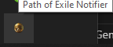
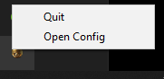

# PoENotifier

A watcher for Path of Exile's `Client.txt` log file that uses regular expressions to display alerts for important game events like Reflecting Mist, Nameless Seer, and rare hideouts.

## Features

- **Real-time log monitoring** using file tailing
- **Customizable regex patterns** for different game events
- **Multiple notification types**: toast notifications and audio beeps
- **System tray integration** for background operation
- **Automatic configuration** creation on first run
- **Detailed logging** for debugging and monitoring

## Installation

1. Download the latest release
2. Run the executable
3. The configuration file will be automatically created after first execution

## Configuration

After the first launch, a configuration file will be created at:

```text
C:\Users\[YourUsername]\Documents\My Games\Path of Exile\Notifier\notifier_config.json
```

You can edit this file to customize alerts according to your needs.

### Configuration Structure

The configuration file contains a JSON object with the following structure:

```json
{
    "patterns": [
        {
            "name": "Pattern Name",
            "regex": "Regular Expression",
            "message": "Notification Message",
            "beep": true,
            "toast": true
        }
    ]
}
```

### Configuration Options

#### Root Object

- **`patterns`** (array): Array containing all alert patterns

#### Pattern Object

Each pattern in the `patterns` array supports the following options:

| Option | Type | Required | Description |
|--------|------|----------|-------------|
| `name` | string | ✅ | Display name for the pattern (used in logs and notifications) |
| `regex` | string | ✅ | Regular expression to match against log lines |
| `message` | string | ✅ | Message to display in toast notifications |
| `beep` | boolean | ✅ | Whether to play a system beep when pattern matches |
| `toast` | boolean | ✅ | Whether to show a toast notification when pattern matches |

### Default Configuration

The application comes with the following default patterns:

#### Nameless Seer

- **Name**: `Nameless seer`
- **Regex**: `\\bThe Nameless Seer has appeared nearby\\b`
- **Description**: Detects when the Nameless Seer appears
- **Notifications**: Toast + Beep

#### Reflecting Mist

- **Name**: `Reflecting Mist`
- **Regex**: `\\bA Reflecting Mist has manifested nearby\\b`
- **Description**: Detects when a Reflecting Mist appears
- **Notifications**: Toast + Beep

#### Area Transition (Test Pattern) - Only in test configuration for dev

- **Name**: `Test`
- **Regex**: `\\bYou have entered\\b`
- **Description**: Detects when entering a new area (useful for testing)
- **Notifications**: Toast + Beep

### Regex Guidelines

When writing regular expressions for patterns:

1. **Use word boundaries** (`\\b`) to avoid partial matches
2. **Escape backslashes** properly in JSON (use `\\` instead of `\`)
3. **Test your regex** before adding to ensure it matches correctly
4. **Be specific** to avoid false positives

### Adding Custom Patterns

To add your own patterns:

1. Open the configuration file in a text editor
2. Add a new pattern object to the `patterns` array
3. Save the file
4. Restart the application

Example of adding a new pattern:

For high value trades when alt tabing for example.
```json
{
    "patterns": [
        // ...existing patterns...
        {
            "name": "High value trade",
            "regex": "\blisted for ((3[1-9])|([4-9][0-9])|([1-9][0-9]{2,})) chaos in Mercenaries\b",
            "message": "Someone wants to trade something worth more than 30c with you",
            "beep": true,
            "toast": true
        }
    ]
}
```

Be creative.

## System Tray



The application runs in the system tray for background monitoring.

### System Tray Features

- **Background Operation**: Runs in the system tray
- **Right-click Menu**: Access to basic actions


### Menu Options

Right-click on the system tray icon to access:

- **Open Config**: Opens the configuration directory in Windows Explorer
- **Quit**: Properly closes the application


### Usage Tips

- The application automatically starts in the system tray
- Check the system tray (bottom-right corner) for the PoE Notifier icon
- Right-click the icon to access the menu options

## Troubleshooting

### Common Issues

- **No notifications**: Check that Path of Exile is installed in the default location, this app does not support any other location yet, check DND mode too.
- **Can't find config folder**: Use the "Open Config" option from the system tray menu, if you use a custom location this won't work either.
- **Regex not matching**: Verify regex syntax and test with online regex tools. See [Regex 101](https://regex101.com/)
- **Configuration errors**: Validate JSON syntax using a JSON validator. See [Json lint](https://jsonlint.com/)

### Log Files

Application logs are stored in the `logs/` directory next to the config file:

```text
logs/poe_notifier_YYYY-MM-DD.log
```

These logs contain detailed information about:

- Application startup
- Configuration loading
- Pattern matching attempts
- Errors and warnings